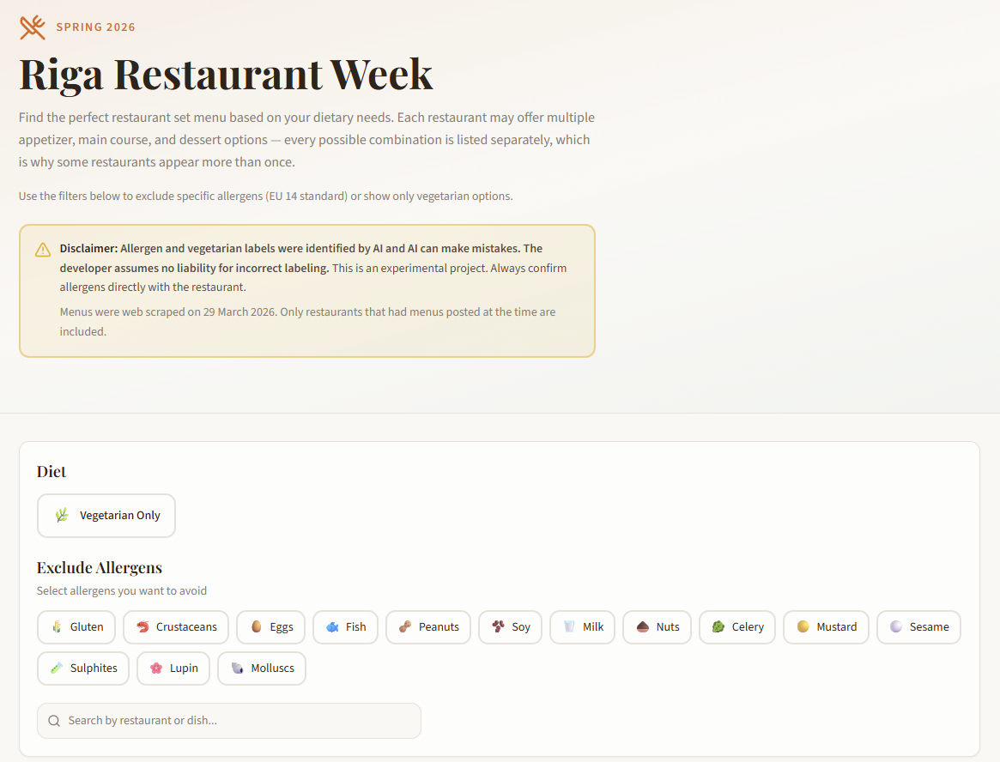
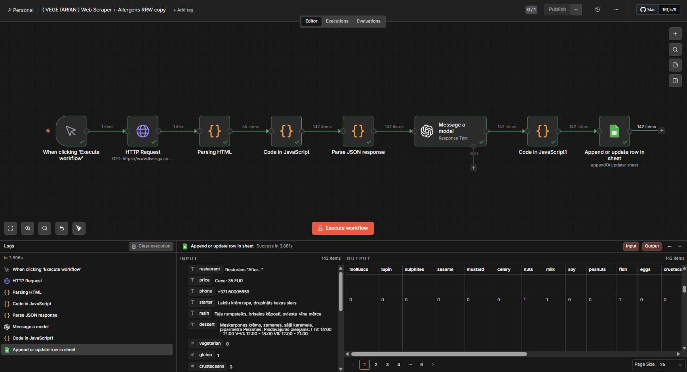

# Riga Restaurant Week Scraper & AI Allergen Analyzer

**Live App:** https://discover-riga-restaurant-week.lovable.app/

This project automates the extraction and analysis of restaurant menus from Riga Restaurant Week using AI. It identifies EU allergens and determines whether meals are vegetarian.

---

## Features

- Web scraping of restaurant menus
- Structured extraction (starter, main, dessert)
- AI-powered allergen detection (EU 14 allergens)
- AI-powered vegetarian classification
- Data export to Google Sheets

---

## How It Works

1. Scrapes restaurant data from liveriga.com  
2. Parses HTML to extract menu items  
3. Generates all meal combinations for each restaurant 
4. Sends meals to AI for allergen classification  
5. Normalizes AI output into structured JSON  
6. Stores results in Google Sheets  

---

## Application Preview



---

## Workflow Architecture



---

## Technologies

- **n8n** – workflow automation  
- **JavaScript** – data parsing and transformation  
- **OpenAI API** – allergen & vegetarian analysis  
- **Claude AI** – JavaScript development assistance  
- **Google Sheets API** – data storage  
- **Lovable** – frontend app builder  

---

## Project Structure
```
ai-restaurant-allergen-analyzer/
│
├── README.md
├── LICENSE
├── workflow/
│ └── n8n-workflow.json
├── docs/
│ ├── architecture.png
│ └── lovable-app.png
└── .gitignore
```

---
## Author
Dinārs Alksnītis

Aspiring Data Scientist / AI & Automation Enthusiast
